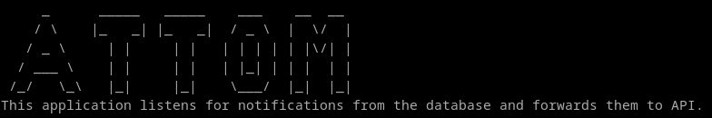

## Sobre Attom



Um projeto de integração do Esus/PEC com uma API de Painel de Eletrônico.

## Aprendendo

O projeto foi compilado para Windows, mas funciona em Linux. Em Windows funciona no modo "service" e no Linux em modo standalone/no-service.

- Para instalar é necessário baixar o executável em https://github.com/carlos-enginner/attom/releases/ e adicionar o arquivo renomeado para "attom.exe" no diretório raiz do sistema, exemplo: "C:\Attom"

- Ao instalar o Attom no diretório C:\Attom é necessário configurar a aplicação para execução em modo administrador;

- Após a configuração de admin da aplicação abra o Prompt de comando, navegue até a pasta do C:\Attom em modo administrador e execute o seguinte comando:

```attom.exe init```

> Ao executar o comando a aplicação fará várias perguntas para permitir a correta comunicação da aplicação com o banco de dados do Esus e com a API externa, e ao término será gerado um arquivo em chamado **config/nenvironment.toml**. Segue um exemplo já gerado:

```
[application]
  timeout_connection_in_seconds = 10

[api]
  endpoint = "https://webhook-test.com/76d788b20b7f99c5bcb6a608ae281ef4"
  token = "58a846d58a0670ea3c3ad54ec5069130"
  ibge = "5210604"

[database]
  host = "localhost"
  port = 5432
  user = "user"
  password = "password"
  dbName = "esus"

[panels]

  [[panels.items]]
    cnes = "2382857"
    description = "Painel Procedimentos"
    cbos = []
    services = ["9", "2", "8"]
    [panels.items.queue]
    panelUuid =  "eb6e9c6b-a196-42ed-8847-752da50bf95c"
    sectorUuid = "631da7f0-fe75-44fc-85c0-bafb56ab12d1"

  [[panels.items]]
    cnes = "2382857"
    description = "Painel Exames"
    cbos = ["2251", "2252"]
    services = ["5"]
    [panels.items.queue]
    panelUuid =  "eb6e9c6b-a196-42ed-8847-752da50bf95c"
    sectorUuid = "631da7f0-fe75-44fc-85c0-bafb56ab12d1"

  [[panels.items]]
    cnes = "2382857"
    description = "Painel Vacinas"
    cbos = ["2251", "2252"]
    services = ["3"]
    [panels.items.queue]
    panelUuid =  "eb6e9c6b-a196-42ed-8847-752da50bf95c"
    sectorUuid = "631da7f0-fe75-44fc-85c0-bafb56ab12d1"

  [[panels.items]]
    cnes = "2382857"
    description = "Painel Triagem"
    cbos = ["3222"]
    services = ["7"]
    [panels.items.queue]
    panelUuid =  "eb6e9c6b-a196-42ed-8847-752da50bf95c"
    sectorUuid = "631da7f0-fe75-44fc-85c0-bafb56ab12d1"

  [[panels.items]]
    cnes = "2382857"
    description = "Painel Consultório Médico"
    cbos = ["2251", "2252", "2235", "2239", "2237"]
    services = ["1","6"]
    [panels.items.queue]
    panelUuid =  "eb6e9c6b-a196-42ed-8847-752da50bf95c"
    sectorUuid = "631da7f0-fe75-44fc-85c0-bafb56ab12d1"

  [[panels.items]]
    cnes = "2382857"
    description = "Painel Consultório Odontológico"
    cbos = ["2232", "322425", "322415"]
    services = ["10", "11", "12", "15", "16", "18", "19"]
    [panels.items.queue]
    panelUuid =  "eb6e9c6b-a196-42ed-8847-752da50bf95c"
    sectorUuid = "631da7f0-fe75-44fc-85c0-bafb56ab12d1"
```
> O arquivo nos dá a orientação de como configurar a comunicação com o bano de dados do Postgres e também a opção de configurar os dados do município em questão que usuará a aplicação, como também para qual painel de chamadas serão direcionadas as movimentações de atendimentos no PEC, como demostrado em panelUuid e sectorUuid. Bastando ajustar as conexões e orientação de qual fila receberá as movimentações a aplicação estará quase pronta para uso.

- Após a geração e devida configuração do .toml, execute o seguinte comando:

```attom.exe prepare_database```

> Esse comando preparará o banco de dados ativando o modo assíncrono de notificação do Postgres entre outras coisas mais.

- Após a **preparação do banco de dados**, execute o seguinte comando:

```attom.exe install_service```

> Esse comando fará a instalação da aplicação no serviço do Windows que poderá ser localizada com o nome de "AttomSvc".

- Após a **instalação no serviço do windows**, execute ```services.msc``` para abrir o serviço do windows, encontre o serviço: AttomSvc e clique em executar.

- Após a ativação do serviço a aplicação estará operacional em modo service, e para facilitar a monitoria/troubleshooting da mesma será criado um arquivo de log com o nome de application.log na pasta chamada "logs" em C:\Attom\Logs. Ao final a aplicação já esta pronta para uso.

## Comandos disponívels no Attom:

```shell
  completion       Generate the autocompletion script for the specified shell
  help             Help about any command
  init             Generates a .config/environment.toml file
  install_service  Installs the service in Windows Services for automatic execution
  prepare_database Prepares the database for asynchronous notifications.
  remove_service   Remove the application on Windows Service
  start            Application start
  update           Application update service
  version          Show version application
```

## Modo desenvolvimento

- Basta executar docker-compose up -d no diretório clonado. Requer docker e docker-compose últimas versões

## Stacks:

- Air
- Golang 1.23
- Postgres/Notify
- Cobra
- Viper
- logrus


## License

Projeto comercial de uso restrito
